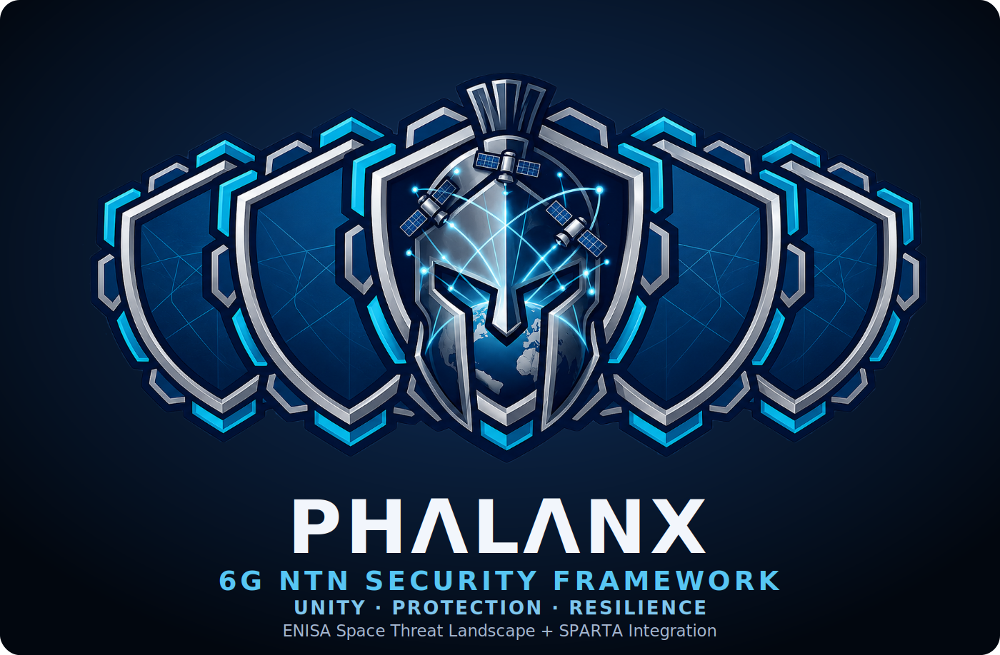

<p align="center">
  
</p>

<p align="center"><em>Crosswalking the ENISA Space Threat Landscape and SPARTA into one line of defense for 6G NTN.</em></p>

---

## The name

In the armies of ancient Greece, a **phalanx** was a wall of warriors who locked their shields
edge to edge into a single unbroken line. No soldier held the wall alone — its strength lived in
the _seam_ between shields, and a single gap could unravel the whole formation. A Spartan hoplite
carried the letter **Λ** (_lambda_, for **Lakedaemon**) on his shield; PHALANX takes it as its mark.

PHALANX does with knowledge what the phalanx did with bronze. Space-threat intelligence is
fragmented: the **ENISA Space Threat Landscape** knows _what_ can go wrong and _where_ — segments,
assets, trust boundaries, lifecycle — while **SPARTA** knows _how_ an adversary actually gets it
done — techniques, tactics, and countermeasures. Kept apart, each leaves gaps the other could
cover. PHALANX interlocks them, asset by asset and threat by threat, into one continuous line of
defense for **6G Non-Terrestrial Networks** — so the seam between _"what"_ and _"how"_ stops being a
blind spot.

That interlock is the whole idea, and it's in the logo: **a phalanx of five shields locked
shoulder to shoulder, a crested Spartan helmet at the center guarding a 6G-NTN globe — and the
wordmark stamped PHΛLΛNX, the A's struck as lambdas for Lakedaemon.**

## What it is

An interactive threat-modeling tool that turns each ENISA space threat into a structured 10-element
tuple and runs a two-pass algorithm over a 6G NTN reference architecture you can watch light up:

```
TR = ⟨ L , S , A , TB , E , Pre , TTP , CM , I , Conf ⟩
       └──── ENISA ────┘  bridge  └─ SPARTA ─┘  record
```

1. **ENISA — what & where.** From the affected-asset set `A`, Pass 1 derives segments `S`, trust
   boundaries `TB`, and lifecycle `L`; the cluster sets category `E`.
2. **Precondition `Pre`** is the state→action bridge (rule R3) linking the two passes.
3. **SPARTA — how.** Pass 2 classifies via rules R1–R10 and maps the technique chain `TTP`,
   countermeasures `CM`, and impact `I` — with a searchable SPARTA picker that auto-suggests the
   countermeasures SPARTA maps to your chosen techniques.

Mitigation is **dual-framework**: SPARTA countermeasures (tactical, technique-mapped) _plus_ ENISA
controls (strategic, threat-mapped and traceable to ISO 27001 / NIST / NIS2 / NASA BPG / BSI / METI),
ranked so the ENISA controls whose theme overlaps your chosen techniques surface first.

## Quickstart

```bash
cd framework/webapp
npm install
npm run dev          # http://localhost:5173
```

See [`framework/webapp/README.md`](framework/webapp/README.md) for the full script list, the
single-source **TypeScript engine guarded by a Python-parity test**, and the data pipeline.

## Data & attribution

Third-party datasets are vendored under `framework/webapp/scripts/vendor/` and compiled to compact
JSON in `framework/webapp/src/data/`:

- **SPARTA** — Space Attack Research & Tactic Analysis, © The Aerospace Corporation
  ([STIX 2.1 v3.2](https://sparta.aerospace.org/), vendored).
- **ENISA Space Threat Landscape — Control Framework**, © ENISA
  ([enisaeu/Space-Threat-Landscape](https://github.com/enisaeu/Space-Threat-Landscape)).

Please observe each source's terms when redistributing their data.

## Repository layout

```
framework/
  webapp/          the PHALANX app (React + Vite + TypeScript)
    src/engine/    canonical algorithm.ts (Python-parity tested) · csv · architecture geometry
    src/components/ TopBar · Architecture · Builder · SpartaPicker · ResultCard · ThreatList
    src/data/      threats.json · sparta.json · enisa_controls.json   (generated)
    scripts/       gen_sparta.py · gen_enisa_controls.py · vendor/ (pinned sources)
  ntn_threat_algorithm.py   reference Python engine + workbook/report builders
assets/            logo
```
